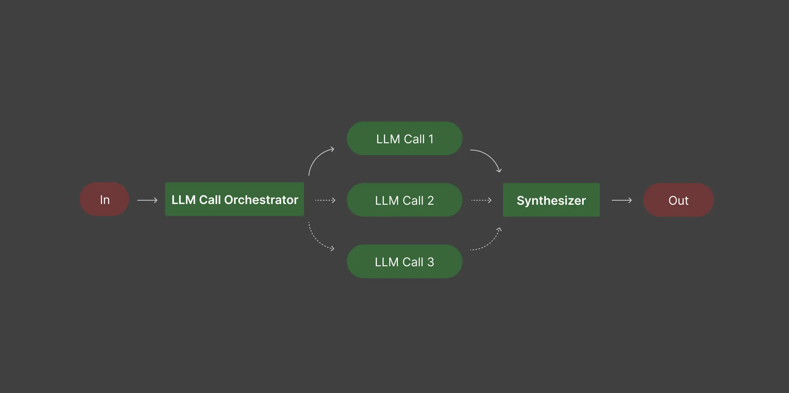

# Orchestrator-workers  協調者
由LLM將任務分解為動態的子任務。然後子任務由多個工作LLMs並行處理。最後輸出綜合成最終結果。



為新型環保水瓶撰寫產品說明。 target_audience 是具有環保意識的千禧世代，主要產品特點是：不含塑膠、絕緣、終身保修

```bash
=== ORCHESTRATOR OUTPUT ===

ANALYSIS:
The task requires creating an appealing product description for a new eco-friendly water bottle aimed at environmentally conscious millennials. Each approach serves a distinct purpose: the formal style provides detailed specifications, catering to consumers who prioritize factual information and technical details. The conversational style fosters a friendly connection, aligning with the values and lifestyle of millennials. The hybrid style creatively weaves technical details into a narrative, making the product relatable and emphasizing its benefits, appealing to both logical and emotional aspects of decision-making.

TASKS:
[
  {
    "type": "formal",
    "description": "Present the product with precise technical specifications, outlining key features such as being plastic-free, its insulation capabilities, and details about the lifetime warranty in a straightforward manner."
  },
  {
    "type": "conversational",
    "description": "Craft a friendly and engaging description that resonates with millennials by highlighting the eco-friendliness of the product and how it fits into their lifestyle, fostering a sense of community and shared values."
  },
  {
    "type": "hybrid",
    "description": "Create a narrative that tells a story around the product, integrating personal experiences with factual details. Highlight its sustainability, insulation benefits, and lifetime warranty, while evoking emotional connections to the environment and responsible living."
  }
]

=== WORKER RESULT (formal) ===
Introducing the EcoPure Insulated Water Bottle, a premium hydration solution meticulously designed for the environmentally conscious millennial. This innovative water bottle embodies a commitment to sustainability, crafted entirely from 100% plastic-free materials, ensuring that your choice contributes positively to the planet.

**Key Features:**

1. **Plastic-Free Construction**: The EcoPure Water Bottle is made from high-grade stainless steel, eliminating the need for plastic in its design. This not only reduces environmental waste but also ensures that no harmful chemicals leach into your beverages.

2. **Advanced Insulation Technology**: Featuring double-wall vacuum insulation, this bottle keeps your beverages cold for up to 24 hours and hot for up to 12 hours. Whether you are enjoying a refreshing iced drink during a summer hike or a comforting warm beverage on a chilly day, the EcoPure Water Bottle maintains your preferred temperature without condensation on the exterior.

3. **Lifetime Warranty**: We stand behind the quality and durability of our products. The EcoPure Water Bottle comes with a lifetime warranty, reflecting our confidence in the craftsmanship and materials used. Should any defects arise under normal use, we are committed to providing you with a replacement, ensuring that your investment is protected for life.

Choose the EcoPure Insulated Water Bottle to not only elevate your hydration experience but also to make a responsible choice for the environment. Join us in the movement towards a sustainable future, one sip at a time.


=== WORKER RESULT (conversational) ===
Meet your new favorite hydration companion: our EcoVibe Water Bottle! Designed for environmentally conscious millennials like you, this bottle isn’t just about quenching your thirst; it’s about making a positive impact on our planet. 

Made from high-quality stainless steel, our EcoVibe Water Bottle is completely plastic-free. That means no more contributing to the plastic pollution crisis—just pure, clean hydration with every sip. Plus, it’s insulated to keep your drinks cold for up to 24 hours and hot for 12, making it the perfect partner whether you’re hitting the gym, heading to the office, or enjoying a weekend adventure outdoors.

But here’s the cherry on top: we believe in our product so much that we offer a lifetime warranty. That’s right! Buy it once and enjoy it for life. You’ll be part of a community that values sustainability, wellness, and a commitment to preserving our beautiful planet for future generations.

Join the movement towards a more sustainable lifestyle with the EcoVibe Water Bottle. It's not just a water bottle; it’s a statement. Grab yours today and let’s make a difference together, one sip at a time! 🌍💧


=== WORKER RESULT (hybrid) ===
In a world where every choice we make echoes through the environment, imagine having a companion that not only keeps you hydrated but also aligns with your values. Meet the EcoSip, the eco-friendly water bottle designed for the modern, environmentally conscious millennial. 

Picture this: you’re hiking through a lush forest, the sun filtering through the leaves, and the sound of a nearby stream whispering sweet nothings to your ears. You reach for your EcoSip, a sleek, plastic-free marvel crafted from stainless steel. As you take a refreshing sip, you can’t help but feel that you’re part of a bigger narrative—one that champions sustainability and the preservation of the planet we love.

With EcoSip, you’re not just choosing a water bottle; you’re making a commitment. Each bottle is designed with the earth in mind, eliminating single-use plastics and ensuring that your hydration doesn’t come at the cost of our beautiful planet. The insulated technology keeps your drinks cold for 24 hours or hot for 12, so whether you’re enjoying a brisk morning coffee or cooling off with ice-cold water after a run, EcoSip has you covered. No more lukewarm beverages—just pure refreshment, exactly when you need it.

But what truly sets EcoSip apart is our promise: a lifetime warranty. Yes, you heard that right. We believe in our product so much that we’re willing to stand by it for life. This means that every time you reach for your EcoSip, you’re not just investing in a water bottle; you’re investing in a sustainable future. It’s a testament to quality and responsibility—two things that resonate deeply with your generation.

As you navigate through life, each sip from your EcoSip is a reminder that you’re making choices that matter. It’s not just about staying hydrated; it’s about creating a ripple effect of positive change. With every EcoSip in the world, we’re collectively reducing plastic waste, conserving resources, and fostering a community of mindful consumers.

Join us on this journey towards a greener future. With EcoSip, you’re not just carrying water; you’re carrying hope, responsibility, and the promise of a better tomorrow. Choose wisely, sip sustainably, and let’s thrive together.
```