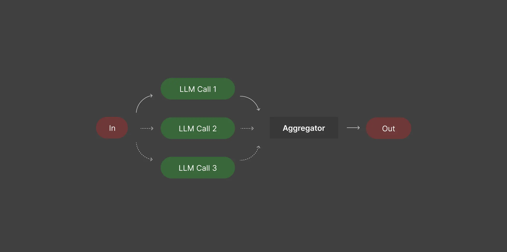

# Parallelization 並行化

並行化利用了可以分解為獨立的任務。使用者的提示同時傳遞給多個LLMs 。一旦所有LLMs做出回應，他們的答案都會發送到最終的LLM呼叫，以匯總為最終答案。



1. 使用 `asyncio.gather` 來平行執行 `run_llm_parallel` 函式，對 `proposer_models` 列表中的每個模型都執行一次。 
2. `asyncio.gather` 會等待所有這些非同步任務完成，並將結果收集到 `proposed_responses` 列表中。
3. 函式返回最終彙整模型的輸出 (`final_output`) 和來自各個提議模型的中間回應 (`proposed_responses`)。

## 輸出說明
```bash
Intermetidate Response 1:

Jenna picked half as many apples as her mom, so she picked 20 / 2 = 10 apples.
Together, Jenna and her mom picked 10 + 20 = 30 apples. 
Therefore, they both picked 30 apples.

Intermetidate Response 2:

If Jenna's mom picked 20 apples, and Jenna picked half as many apples as her mom, we can calculate the number of apples Jenna picked as follows:
...

Intermetidate Response 3:

If Jenna's mom picked 20 apples and Jenna picked half as many as her mom, then Jenna picked:
...

Intermetidate Response 4:

If Jenna's mom picked 20 apples, Jenna picked half as many, which is:
...

Final Answer: To determine how many apples Jenna and her mother picked together, we can follow these steps:

1. **Identify the number of apples picked by Jenna's mom**: Jenna's mom picked 20 apples.
2. **Calculate the number of apples Jenna picked**: Since Jenna picked half as many apples as her mom, we calculate Jenna's apples as follows:
   \[
   \text{Jenna's apples} = \frac{1}{2} \times \text{Mom's apples} = \frac{1}{2} \times 20 = 10
   \]
3. **Calculate the total number of apples picked**: To find the total number of apples picked by both Jenna and her mom, we add the apples picked by each:
   \[
   \text{Total apples} = \text{Jenna's apples} + \text{Mom's apples} = 10 + 20 = 30
   \]

Therefore, Jenna and her mother picked a total of **30 apples**.
```