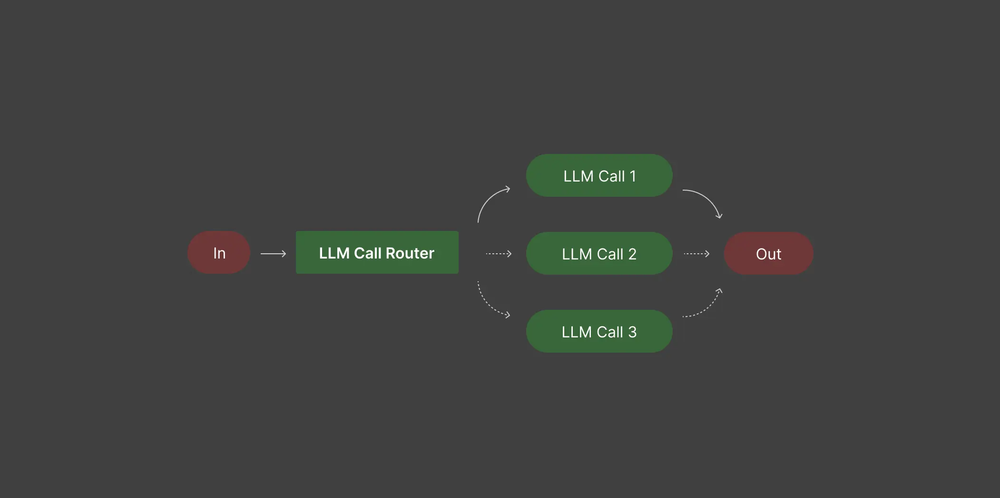

# Routing 範例
使用者輸入被分類到特定任務的工作流程（可以是特定的LLM 、特定提示等），可以單獨去優化單一流程。



1. 將簡單/常見問題路切換到較小模型，將困難/不常見問題路由到功能更強大的模型，以優化成本和速度。
2. 將不同類型的客戶服務查詢（一般問題、退款請求、技術支援）引導到不同的下游流程、提示和工具。

## 輸出說明
```bash
Task 1: Produce python snippet to check to see if a number is prime or not.

========================================
Selected route:gpt-3.5-turbo
Reason: This model is optimized for code generation tasks, making it ideal for producing a Python snippet to check for prime numbers.

Response: ...

Task 2: Plan and provide a short itenary for a 2 week vacation in Europe.

========================================
Selected route:gpt-4o
Reason: Best model for reasoning, planning and multi-step tasks, ideal for creating a detailed travel itinerary.

Response: Planning a two-week vacation in Europe ...

Task 3: Write a short story about a dragon and a knight.

========================================
Selected route:gpt-4o-mini
Reason: This model is specifically optimized for story-telling, ...
```